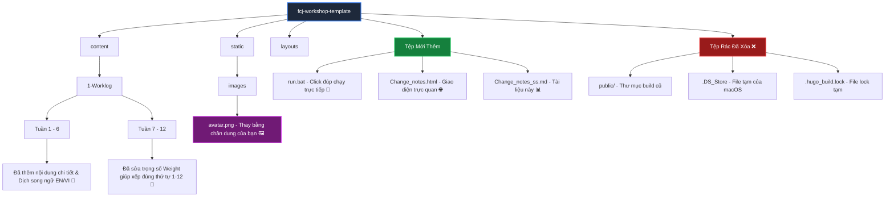

# 📊 Nhật Ký Thay Đổi & Nâng Cấp Hệ Thống (AWS Worklog)

Dưới đây là tài liệu tổng hợp trực quan các thay đổi, nâng cấp cấu trúc thư mục, nội dung bài viết và giao diện website báo cáo thực tập AWS của bạn.

---

## 🛠️ Trực Quan Sơ Đồ Thay Đổi Cấu Trúc

---

## 📝 Bảng Tổng Hợp Chi Tiết Các Thay Đổi

| Thành Phần | Loại Thay Đổi | Đường Dẫn Tệp | Chi Tiết Thay Đổi |
| :--- | :---: | :--- | :--- |
| **Ảnh Đại Diện** | 🖼️ Cập Nhật | `static/images/avatar.png` | Thay thế ảnh avatar mặc định bằng hình ảnh chân dung thực tế của bạn. |
| **Nội Dung Học Tập** | 📝 Thêm Mới | `content/1-Worklog/1.1-Week1` đến `1.6-Week6` | Cập nhật mục tiêu, công việc chi tiết hàng ngày và thành tựu (EC2, VPC, S3, RDS, Lambda, SQS, CloudWatch) bằng **tiếng Anh** và **tiếng Việt**. |
| **Thứ Tự Sidebar** | 🔧 Sắp Xếp | `content/1-Worklog/1.7-Week7` đến `1.12-Week12` | Chỉnh sửa thuộc tính `weight` trong front matter của 12 tệp để sidebar sắp xếp chuẩn thứ tự thời gian tuyến tính (từ 1.1 đến 1.12). |
| **Hỗ Trợ Khởi Động** | 🚀 Thêm Mới | `run.bat` | Viết tập lệnh Batch khởi động Hugo Server nhanh bằng cách click đúp chuột, tự động mở cổng trên tất cả giao diện IPv4/IPv6. |
| **Bỏ Cảnh Báo Deprecated** | 🛠️ Sửa Lỗi | `config.toml` | Thay thế khoá cũ `languageName` bằng `label` giúp loại bỏ cảnh báo lỗi khi Hugo compile. |
| **Độ Tin Cậy API** | 🛠️ Sửa Lỗi | `layouts/shortcodes/ghcontributors.html` | Cải tiến cách kiểm tra remote resource của GitHub API để tránh bị giới hạn API hoặc sinh lỗi làm treo trang web. |
| **Chặn File Rác** | 🔒 Cấu Hình | `.gitignore` | Thêm `.DS_Store` và `.hugo_build.lock` vào danh sách bỏ qua của Git để ngăn chặn rác hệ thống tự sinh ra sau này. |
| **Tài Liệu Báo Cáo** | 📊 Thêm Mới | `Change_notes.html` & `Change_notes_ss.md` | Bản ghi chép thay đổi trực quan (dạng trang web và tài liệu Markdown). |

---

## ⚡ Hướng Dẫn Chạy Nhanh Local Website

Không cần thiết lập gì phức tạp nữa:
1. Vào thư mục gốc `fcj-workshop-template`.
2. Nhấp đúp chuột (Double click) vào tệp **`run.bat`**.
3. Mở trình duyệt web của bạn và truy cập: **[http://localhost:1313/](http://localhost:1313/)** hoặc **[http://127.0.0.1:1313/](http://127.0.0.1:1313/)**.
4. Khi muốn đóng server, chỉ cần tắt cửa sổ Command Prompt vừa hiện ra.
