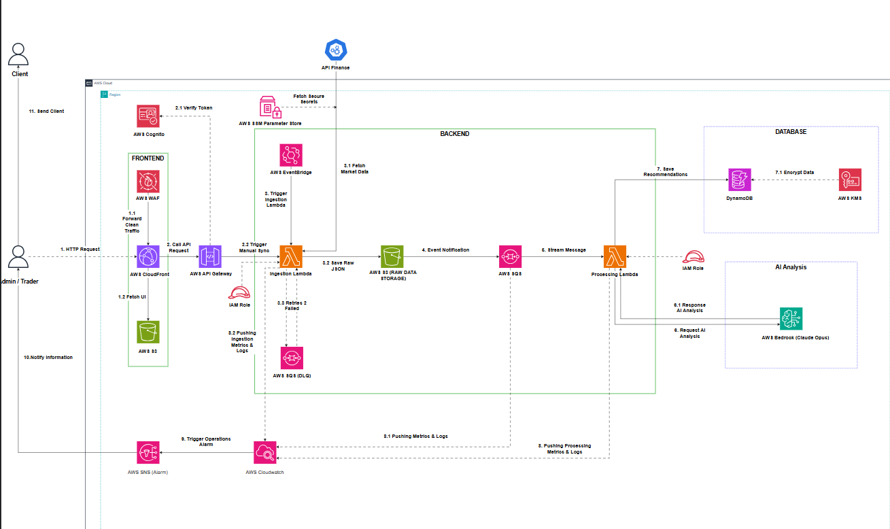

# ĐỀ XUẤT DỰ ÁN: HỆ THỐNG PHÂN TÍCH VÀ CẢNH BÁO GIÁ CỔ PHIẾU (STOCK ALERTS SYSTEM)
## Giải pháp AWS Serverless & AI Agent toàn diện cho Trader chuyên nghiệp

### 1. Tóm tắt điều hành
Dự án nhằm xây dựng một hệ thống phân tích, lập luận logic và cảnh báo giá cổ phiếu tự động theo thời gian thực dựa trên nền tảng điện toán đám mây AWS Serverless Architecture phối hợp cùng trí tuệ nhân tạo Claude (Amazon Bedrock). Hệ thống phục vụ cho các Trader trong việc giám sát thị trường, tự động tính toán chỉ số kỹ thuật và tạo báo cáo phân tích sâu sắc để gửi tới Khách hàng cuối (End-user). Bằng cách tách biệt phần xử lý số liệu định lượng và lý luận ngôn ngữ của AI , hệ thống đảm bảo độ chính xác tuyệt đối, giảm thiểu tối đa hiện tượng ảo tưởng (hallucination) của AI và hoạt động theo cơ chế Human-in-the-loop để kiểm duyệt an toàn trước khi xuất bản chiến lược.

### 2. Tuyên bố vấn đề
	Vấn đề hiện tại: Các Trader thường phải đối mặt với lượng thông tin khổng lồ từ thị trường bao gồm biểu đồ kỹ thuật và tin tức vĩ mô biến động từng phút. Việc phân tích thủ công tốn nhiều thời gian, dễ bỏ lỡ cơ hội hoặc đưa ra quyết định cảm tính. Bên cạnh đó, nếu sử dụng các mô hình AI thông thường để phân tích tài chính, chúng rất dễ làm toán sai (sai lệch chỉ số kỹ thuật RSI, MACD) hoặc bịa đặt tin tức (ảo tưởng AI) gây rủi ro lớn trong đầu tư.  

	*Giải pháp: Hệ thống giải quyết triệt để bằng cách tách đôi tác vụ: Code Python chạy trên AWS Lambda chịu trách nhiệm tính toán chỉ số kỹ thuật chính xác 100% , sau đó nhồi làm ngữ cảnh (RAG) để AI Agent (Claude Opus/Sonnet) lập luận đưa ra khuyến nghị chất lượng cao. Giao diện Dashboard được bảo mật giúp Trader dễ dàng "Chỉnh sửa nhanh" hoặc "Duyệt & Gửi" chiến lược sang cho Khách hàng qua Email/SNS.
	
	Lợi ích và hoàn vốn đầu tư (ROI): Tối ưu hóa 90% thời gian tổng hợp dữ liệu của Trader. Chi phí vận hành hạ tầng AWS áp dụng chiến lược tối ưu tiệm cận 0 ĐỒNG nhờ tận dụng triệt để gói AWS Free Tier cho đồ án.

### 3. Kiến trúc giải pháp
	Hệ thống được thiết kế theo mô hình 100% Serverless (Pay-as-you-go), chia làm 4 tầng độc lập chuẩn DevOps:  Tầng Frontend & Dashboard: Build bằng .JS, deploy lên S3 Static Hosting tích hợp CloudFront CDN giúp phân phối tốc độ cao mà không cần thuê server web. 

	Tầng Ingestion & Math Engine: Sử dụng các hàm AWS Lambda tách biệt tác vụ cào dữ liệu thô và xử lý số liệu. Dữ liệu lịch sử lấy từ yfinance , dữ liệu real-time từ yahoo-finance API.
	
	Tầng AI Analytics Engine: Trí tuệ nhân tạo Claude (Amazon Bedrock) làm bộ não lý luận phục vụ giải thích mô hình (Explainable AI).

	Tầng Database & Storage: Amazon S3 lưu raw file JSON và Amazon DynamoDB lưu dữ liệu time-series có cấu trúc.

### 4. Triển khai kỹ thuật

Luồng vận hành 6 bước khép kín (End-to-End Workflow)

		Kích hoạt & Cào dữ liệu: EventBridge kích hoạt Ingestion Lambda theo giờ thị trường chứng khoán để lấy data từ Yahoo Finance rồi đẩy vào S3.
		
		Tính toán số liệu định lượng: S3 Event Notification đẩy message vào SQS Main Queue nhằm throttle concurrency (tránh nghẽn/quá tải Lambda). Processing Lambda đọc message và dùng thư viện pandas-ta để tính toán chính xác chỉ số RSI, MACD.

		Phân tích AI (GenAI Reasoning): Gọi Claude qua Bedrock bằng Prompt động. Ép Claude xuất cấu trúc JSON nghiêm ngặt chứa Khuyến nghị, Điểm tự tin (Confidence Score) và Chuỗi lập luận logic. Tín hiệu có Score < 75 sẽ tự động bị loại bỏ.

		Lưu trữ Time-Series: Kết quả ghi vào DynamoDB mã hóa bằng AWS KMS Key với thiết kế Composite Primary Key (PK: TICKER#<Mã_Cổ_Phiếu> và SK: TIMESTAMP#<YYYYMMDD-HHMMSS>) giúp truy vấn dữ liệu 30 ngày dưới 10ms.

		Bắn Alerts & Đẩy lên Dashboard: Lambda gọi trực tiếp Telegram Bot API (phương thức sendMessage) cảnh báo cho Trader. Trader đăng nhập Dashboard qua Amazon Cognito nhận mã JWT, đi qua API Gateway có sẵn tính năng Rate-Limiting để chống DDoS.

		Kiểm duyệt cuối (Human-in-the-loop): Trader đối chiếu biểu đồ nến (TradingView Lightweight Charts) và lập luận của AI để bấm nút duyệt gửi cho Khách hàng.

### 5. Lộ trình & Mốc triển khai

	Tháng 5: Học AWS và tìm hiểu về các SERVICES sẽ sử dụng trong project.
	Tháng 6: Thiết kế, điều chỉnh kiến trúc và phân chia công việc cho các thành viên.
	Tháng 7: Triển khai project, kiểm thử và fix lỗi.

### 6. Ước tính ngân sách (Budget Estimation)

	- Amazon EventBridge: ~8,800 sự kiện kích hoạt Miễn phí  0.00 USD
	- AWS Lambda:         ~17,600 lượt chạy (Cào + Xử lý) 0.00 USD/1 triệu request
	- Amazon SQS:         ~17,600 thông điệp (Main + DLQ) 0.00 USD/1 triệu request
	- Amazon S3           ~Lưu trữ JSON thô (~200 MB/tháng) 0.00 USD/5GB
	- Amazon DynamoDB     ~2,200 bản ghi dữ liệu phân tích 0.00 USD/25GB
	- Amazon API Gateway  ~5,000 lượt gọi từ Dashboard 0.00 USD/1 triệu request
	- Amazon Cognito1     ~Tài khoản quản trị (Trader) 0.00 USD/50.000 MAU miễn phí
	- AWS SSM Parameter   ~Store Lưu trữ API Keys an toàn 0.00 USD/Standard Parameter
	- Amazon CloudWatch   ~Metric & Logs 0.00 USD/dưới 5GB
	- Amazon Bedrock (3.5 Sonnet) ~9.90 USD/2,200 requests phân tích

*Tổng ngân sách hạ tầng AWS cố định: 0 ĐỒNG*

Giai đoạn DEV / TEST (Dùng Claude 3.5 Sonnet): * Input: ~1,500 tokens (dữ liệu TA + text tin tức vĩ mô) -> 2,200 \times 1,500 = 3.3M tokens. Giá: 3.00 USD / 1M tokens. Chi phí = 9.90 USD -> Tổng chi phí khi Dev bằng Sonnet: 19.80 USD / tháng.

Ngân sách biến đổi cho AI Agent: Khoảng 19.80 USD/tháng (chỉ phát sinh khi dev chạy thực tế).

### 7. Đánh giá rủi ro

	- Rủi ro 1: Vượt ngưỡng chi phí AI (Bedrock Token Burst): Nếu thị trường biến động mạnh, số lượng mã đạt điểm tự tin >= 75 tăng đột biến dẫn đến gọi Claude liên tục gây tốn tiền token
		- Chiến lược giảm thiểu: Đặt tính năng giới hạn cứng (Quota/Rate-limit) số lần gọi Bedrock tối đa trong một ngày ngay trong code Lambda. Sử dụng Claude 3.5 Sonnet làm nền tảng chính để tiết kiệm chi phí.

	- Rủi ro 2: Lỗi nghẽn hệ thống khi nhiều file đổ về S3 cùng lúc 
		- Chiến lược giảm thiểu: Đã giải quyết triệt để ở bản nâng cấp V3.1 bằng cách chèn SQS Main Queue làm bộ đệm trung gian để throttle concurrency, ép Lambda xử lý tuần tự có kiểm soát.

	- Rủi ro 3:  yfinance API bị lỗi kết nối/chặn request:
		- Chiến lược giảm thiểu: Cấu hình Lambda tự động Retry 2 lần. Nếu vẫn sập, đẩy message lỗi sang Dead-Letter Queue (DLQ) và kích hoạt CloudWatch Alarm bắn alert về Telegram báo cho Trader xử lý thủ công

### 8. Kết quả kỳ vọng

	- Cải tiến kỹ thuật: Xây dựng thành công một hệ thống xử lý bất đồng bộ (Asynchronous Workflow) có khả năng chống chịu lỗi cao. Áp dụng chuẩn kiến trúc bảo mật Zero-Trust từ Cognito, HTTPS mã hóa ACM cho đến quản lý Secrets bằng SSM Parameter Store.

	- Giá trị thực tiễn: Tạo ra một công cụ AI trợ lý đắc lực giải thích được lý do tại sao đưa ra hành động (Explainable AI nhờ Reasoning Trace) , giúp các Trader vừa tối ưu hóa hiệu suất đầu tư, vừa bảo đảm an toàn thông tin tuyệt đối trước khi gửi phương án cho khách hàng.

### 9. Mô hình kiến trúc hệ thống

