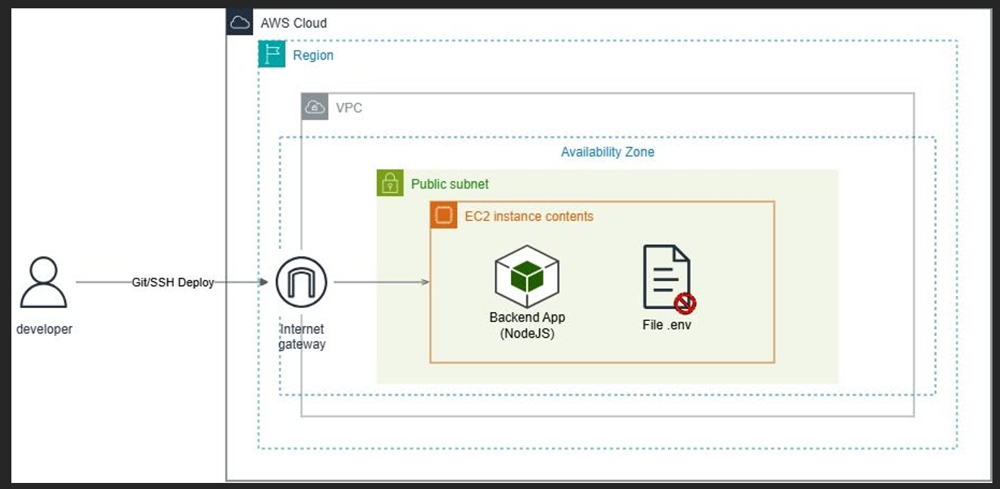
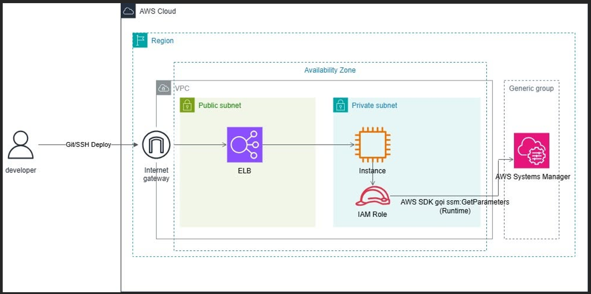

# [CHIA SẺ KINH NGHIỆM] Deploy Backend lên AWS EC2 và lỗi chỉ vì chữ hoa

### 1. Giới thiệu
Trong quá trình học và thực hành triển khai ứng dụng trên AWS EC2, mình đã gặp một lỗi khá thú vị nhưng cũng cực kỳ mất thời gian debug.

Ban đầu, tụi mình nghĩ rằng chỉ cần:

* Code chạy ổn ở Local
* Copy source code lên EC2
* Cấu hình file `.env`
* Start server

Là ứng dụng sẽ hoạt động bình thường. Tuy nhiên, thực tế lại không đơn giản như vậy. Khi deploy Backend từ môi trường Windows Local lên EC2 Ubuntu/Linux, hệ thống bắt đầu xuất hiện hàng loạt lỗi logic:

* Ứng dụng không nhận đúng trạng thái môi trường
* Một số chức năng tự động không hoạt động
* Config Boolean luôn trả về sai
* App không báo lỗi rõ ràng nhưng logic chạy bất thường

Sau nhiều giờ kiểm tra, mình phát hiện nguyên nhân đến từ một chi tiết cực nhỏ: chữ hoa và chữ thường trong Environment Variables.

Qua bài viết này, mình muốn chia sẻ lại trải nghiệm thực tế khi quản lý file `.env` trên AWS EC2, đồng thời giới thiệu một số hướng tối ưu bảo mật theo chuẩn AWS.

### 2. Environment Variables là gì?
Trong các dự án Backend hiện nay, việc sử dụng Environment Variables, hay biến môi trường, gần như là tiêu chuẩn bắt buộc.

Thay vì hard-code các thông tin cấu hình trực tiếp vào source code, developer sẽ lưu chúng vào file `.env`.

Ví dụ:

```env
ENV=development
REGION=ap-southeast-1
ENVIRONMENT_AUTO=True
```

Cách làm này giúp:

* Tăng tính bảo mật
* Dễ chuyển đổi giữa môi trường Development / Production
* Dễ quản lý cấu hình
* Hạn chế sửa source code khi deploy

Khi triển khai ứng dụng lên AWS EC2, file `.env` thường sẽ được copy hoặc tạo trực tiếp trên server để ứng dụng đọc khi runtime.

### 3. Mô hình triển khai trên AWS EC2
Mình sử dụng mô hình triển khai cơ bản như sau:

```text
Developer (Local) -> Source Code + .env -> SSH Deploy lên EC2 -> Amazon EC2 (Ubuntu/Linux) -> Backend Application
```

Trong quá trình deploy:

* Source code được upload lên EC2
* File `.env` được cấu hình thủ công
* Backend server được start bằng Node.js

Mọi thứ tưởng chừng hoạt động ổn định cho đến khi application bắt đầu xử lý các biến Boolean.

### 4. Vấn đề phát sinh trên AWS EC2
Ở môi trường Windows Local:

* Ứng dụng hoạt động hoàn toàn bình thường
* Các flag Boolean được xử lý đúng logic

Ví dụ:

```env
ENVIRONMENT_AUTO=True
```

Khi chạy ở Local, hệ thống hiểu đây là giá trị bật (`true`) và chức năng auto configuration hoạt động đúng.

Tuy nhiên sau khi deploy lên EC2 Ubuntu/Linux:

* Hệ thống không nhận đúng giá trị
* Một số đoạn `if-condition` luôn trả về `false`
* Logic xử lý bị sai dù không xuất hiện error rõ ràng

Sau quá trình debug, mình phát hiện ra 2 nguyên nhân chính.

### 5. Nguyên nhân gây lỗi
#### 5.1 Linux phân biệt chữ hoa và chữ thường nghiêm ngặt hơn
Khác với Windows, môi trường Linux trên AWS EC2 xử lý dữ liệu mang tính case-sensitive rất cao.

Ví dụ, `True` và `true` có thể bị parse khác nhau tùy framework hoặc thư viện xử lý `.env`.

Trong một số trường hợp:

* `"True"` chỉ là string
* Không được convert sang Boolean
* Khi so sánh điều kiện sẽ trả về sai

Ví dụ:

```js
if (process.env.ENVIRONMENT_AUTO === "true")
```

Khi `.env` chứa:

```env
ENVIRONMENT_AUTO=True
```

Thì condition trên sẽ luôn fail. Đây là lỗi cực kỳ dễ gặp khi deploy từ Windows sang Linux.

#### 5.2 Quản lý file `.env` thủ công trên EC2
Ban đầu mình tạo file `.env` trực tiếp trên server bằng lệnh:

```bash
nano .env
```

Cách này tuy nhanh nhưng tồn tại nhiều vấn đề:

* Dễ typo
* Dễ thiếu biến
* Khó đồng bộ giữa các môi trường
* Khó quản lý khi hệ thống mở rộng
* Có nguy cơ lộ thông tin nhạy cảm nếu EC2 bị truy cập trái phép

Ngoài ra, secret key, database password và API token nếu lưu trực tiếp trên server sẽ không đúng best practice bảo mật của AWS.

### 6. Giải pháp mình áp dụng
#### 6.1 Quick Fix: Đồng bộ dữ liệu Boolean
Mình sửa toàn bộ giá trị Boolean trong `.env` về dạng lowercase:

```env
ENVIRONMENT_AUTO=true
```

Đồng thời:

* Normalize dữ liệu trước khi xử lý
* Sử dụng `.toLowerCase()`
* Ép kiểu Boolean rõ ràng

Ví dụ:

```js
const autoEnv = process.env.ENVIRONMENT_AUTO?.toLowerCase() === "true";
```

Sau khi chỉnh sửa:

* Logic hoạt động ổn định
* App nhận đúng trạng thái môi trường
* Không còn lỗi sai condition

#### 6.2 Hướng tối ưu theo chuẩn AWS
Sau khi tìm hiểu thêm về AWS Best Practices, mình nhận ra rằng việc lưu `.env` trực tiếp trên EC2 không phải giải pháp tối ưu về bảo mật.

Do đó nhóm đang nghiên cứu chuyển sang:

* AWS Systems Manager Parameter Store
* AWS Secrets Manager

Lợi ích:

* Quản lý biến môi trường tập trung
* Tăng tính bảo mật
* Không cần hard-code secret
* Kiểm soát quyền truy cập bằng IAM Role
* Dễ scale hệ thống

Thay vì EC2 đọc file `.env` trực tiếp, hệ thống có thể chuyển sang:

```text
EC2 -> IAM Role -> AWS Parameter Store
```

Để lấy biến môi trường an toàn hơn. Đây cũng là hướng triển khai phổ biến trong các hệ thống Production trên AWS.

### 7. Bài học rút ra
Qua trải nghiệm lần này, mình rút ra một số kinh nghiệm quan trọng.

Cloud Linux khác Local Windows nhiều hơn mình nghĩ. Một số lỗi nhỏ ở Local có thể trở thành vấn đề lớn khi deploy lên Linux.

Những lỗi vặt thường tốn thời gian debug nhất. Không phải lúc nào hệ thống lỗi cũng do code phức tạp. Đôi khi chỉ sai chữ hoa/chữ thường, sai kiểu dữ liệu hoặc sai format `.env` cũng có thể khiến application hoạt động sai hoàn toàn.

Quản lý Environment Variables rất quan trọng. Environment Variables không chỉ là config, mà còn liên quan đến bảo mật, quản lý hệ thống, khả năng scale và độ ổn định khi deploy Production.

### 8. Kết luận
Qua bài thực hành này, mình hiểu rõ hơn về:

* Cách AWS EC2 hoạt động trên Linux
* Tầm quan trọng của Environment Variables
* Những khác biệt giữa Local và Cloud Environment
* Các hướng quản lý secret theo chuẩn AWS

Đây là bài chia sẻ mà mình rút ra được nhằm tránh được những lỗi tương tự khi deploy ứng dụng lên AWS EC2.

Nếu mọi người có thêm kinh nghiệm về AWS Secrets Manager, Parameter Store, quản lý `.env`, hoặc best practice deploy Backend thì hãy cùng trao đổi bên dưới nhé!

### Hình ảnh kiến trúc





### Link Facebook
[Xem bài viết/trang Facebook](https://web.facebook.com/groups/660548818043427/user/100050719642663/)

#AWS #EC2 #AWSCloud #EnvironmentVariables #CloudComputing #AWSStudyGroupVN #Backend #DevOps
