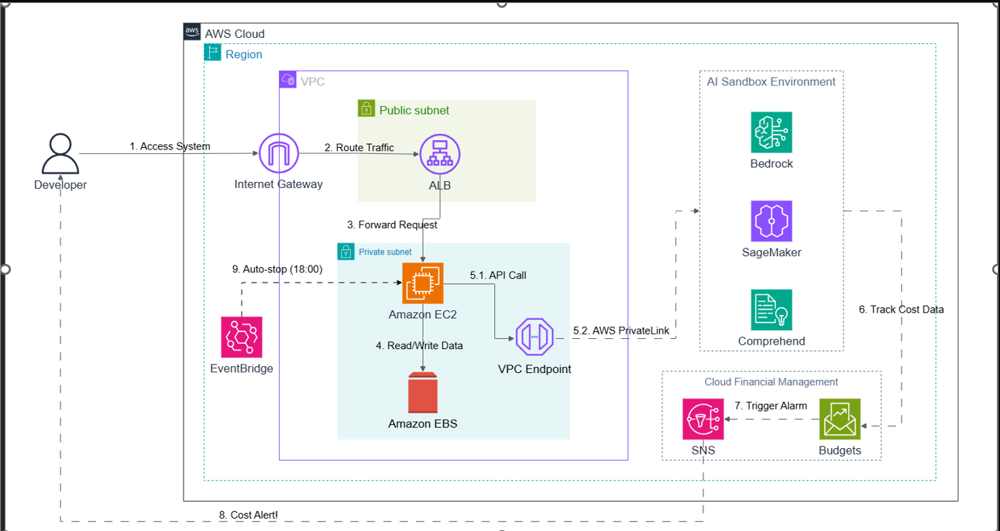

# [CHIA SẺ KINH NGHIỆM] AWS Cost & AI: Khi "chạy cloud" không còn là vấn đề kỹ thuật mà là vấn đề tiền

### 1. Giới thiệu
Trong quá trình học và thực hành trên AWS, nhóm mình ban đầu chỉ tập trung vào việc:

* Deploy application lên EC2
* Cấu hình môi trường chạy backend
* Hiểu cách vận hành cloud cơ bản

Tuy nhiên, khi hệ thống bắt đầu hoạt động ổn định hơn, một vấn đề mới xuất hiện mà trước đây nhóm mình chưa thực sự quan tâm đúng mức: chi phí vận hành trên AWS, hay Cloud Cost.

Song song với đó, trong quá trình tìm hiểu mở rộng, nhóm mình cũng bắt đầu tiếp cận thêm các dịch vụ liên quan đến AI của AWS như:

* Amazon Bedrock
* Amazon SageMaker ở mức cơ bản
* AWS AI Services như Comprehend và Rekognition

Và lúc đó, tụi mình nhận ra một điều khá quan trọng:

> Cloud không chỉ là "deploy được hay không", mà còn là "chạy như vậy có tốn bao nhiêu tiền mỗi ngày".

### 2. Bối cảnh hệ thống thực hành
Nhóm mình đang triển khai một hệ thống backend đơn giản trên AWS:

* EC2 Ubuntu chạy Node.js backend
* Một số API xử lý logic ứng dụng
* Logging và test request liên tục trong quá trình học

Ở giai đoạn đầu, do nằm trong AWS Free Tier nên nhóm mình khá chủ quan, nghĩ rằng:

* EC2 `t2.micro` miễn phí
* Chạy thoải mái không vấn đề

Tuy nhiên thực tế khi mở rộng test, hệ thống bắt đầu phát sinh các yếu tố ảnh hưởng đến chi phí:

* EC2 uptime liên tục 24/7
* Log tăng dần theo request
* Một số tài nguyên phụ trợ bị bật nhưng không tắt
* Có thử nghiệm thêm AI service dẫn đến chi phí phát sinh ngoài dự kiến

### 3. Hiểu sai về Free Tier: không có nghĩa là miễn phí mãi
Một hiểu lầm phổ biến mà nhóm mình gặp phải là nghĩ Free Tier đồng nghĩa với:

* Không tốn tiền
* Có thể dùng vô hạn

Thực tế, Free Tier chỉ giới hạn theo thời gian và mức sử dụng. Nếu vượt ngưỡng, AWS sẽ tính phí ngay lập tức.

Trong trường hợp của nhóm mình:

* EC2 chạy liên tục không shutdown
* Một số thử nghiệm tạo thêm tài nguyên nhưng quên xóa
* Storage EBS tăng dần theo thời gian

Điều này dẫn đến việc chi phí bắt đầu xuất hiện dù ban đầu không dự tính.

### 4. Khi AI được đưa vào hệ thống, chi phí thay đổi hoàn toàn
Sau khi tìm hiểu thêm về AWS AI Services, nhóm mình thử nghiệm một số hướng:

* Xử lý text bằng Amazon Comprehend
* Thử gọi API AI generative ở mức demo
* Nghiên cứu Amazon Bedrock cho use case chatbot

Và đây là lúc bài toán chi phí trở nên rõ ràng hơn.

Khác với EC2, vốn thường tính theo thời gian chạy, các dịch vụ AI thường tính theo:

* Số request
* Số token xử lý
* Lượng dữ liệu phân tích

Điều này dẫn đến một vấn đề: chi phí không còn dễ đoán như EC2 nữa.

Ví dụ, một API call nhỏ có thể không đáng kể. Nhưng khi test nhiều lần liên tục, chi phí có thể cộng dồn nhanh hơn dự kiến.

### 5. Nguyên nhân chính khiến chi phí tăng nhanh
Sau khi phân tích lại hệ thống, nhóm mình nhận ra 3 nguyên nhân chính.

Thứ nhất, chưa kiểm soát tốt tài nguyên đang chạy:

* EC2 không được stop khi không sử dụng
* Một số volume EBS không được dọn
* Không có cơ chế auto shutdown

Thứ hai, thiếu monitoring chi phí. Ban đầu nhóm mình gần như không sử dụng:

* AWS Cost Explorer
* Billing Alert
* Budget tracking

Điều này khiến việc phát hiện chi phí phát sinh bị chậm.

Thứ ba, thử nghiệm AI nhưng chưa có giới hạn rõ ràng:

* Không giới hạn request
* Không set budget alert
* Không kiểm soát môi trường sandbox

Điều này dẫn đến việc khó kiểm soát mức tiêu thụ tài nguyên.

### 6. Hướng giải quyết và tối ưu chi phí
Sau khi nhận ra vấn đề, nhóm mình bắt đầu điều chỉnh lại cách sử dụng AWS theo hướng cost-aware.

#### 6.1 Kiểm soát tài nguyên EC2
Nhóm mình thay đổi cách sử dụng EC2:

* Chỉ bật EC2 khi cần test
* Stop instance sau khi sử dụng
* Xóa resource không cần thiết

#### 6.2 Thiết lập AWS Cost Management
Nhóm mình bắt đầu sử dụng:

* AWS Budgets để đặt giới hạn chi phí
* Billing Alarm để cảnh báo khi vượt ngưỡng
* Cost Explorer để theo dõi chi phí theo ngày

#### 6.3 Tách môi trường AI sandbox
Thay vì test AI trực tiếp trong hệ thống chính, nhóm mình chuyển sang hướng:

* Tạo môi trường riêng cho thử nghiệm
* Giới hạn số request
* Không kết nối trực tiếp với production flow

#### 6.4 Hiểu lại cách AWS tính phí
Điều quan trọng nhất nhóm mình học được là mỗi service có một logic chi phí khác nhau:

* EC2 tính theo thời gian chạy
* Storage tính theo dung lượng
* AI services tính theo request, token hoặc dữ liệu xử lý

Vì vậy không thể áp dụng chung một cách hiểu chi phí cho tất cả dịch vụ.

### 7. AWS AI: góc nhìn thực tế sau khi trải nghiệm
Sau khi thử một số dịch vụ AI của AWS, nhóm mình nhận thấy AWS AI rất mạnh về tích hợp hệ thống và dễ kết nối với backend thông qua SDK.

Tuy nhiên, chi phí cần được kiểm soát chặt. Đặc biệt với các mô hình AI generative, điều quan trọng không phải chỉ là dùng được hay không, mà là dùng như thế nào để không bị vượt ngân sách.

### 8. Bài học rút ra
#### 8.1 Cloud không chỉ là kỹ thuật, mà là vận hành
Làm việc với AWS không chỉ là deploy app hay chạy server, mà còn là:

* Quản lý tài nguyên
* Tối ưu chi phí
* Theo dõi hệ thống liên tục

#### 8.2 AI không miễn phí như cảm giác ban đầu
Càng test nhiều thì càng tốn tiền. Càng prompt dài thì càng tăng token cost. Cần thiết kế logic chi phí từ đầu, không phải sau khi hệ thống đã chạy.

#### 8.3 Monitoring là bắt buộc, không phải optional
Không có monitoring nghĩa là không biết mình đang tiêu bao nhiêu, không kiểm soát được scale và dễ vỡ budget mà không nhận ra.

#### 8.4 Automation là bước nâng cấp tư duy
Từ việc tắt thủ công EC2 chuyển sang scheduler, event-driven shutdown và lifecycle automation là bước chuyển từ user AWS sang operator AWS.

### 9. Kết luận
Qua bài thực hành và tìm hiểu thêm về AWS Cost & AI Services, nhóm mình hiểu rõ hơn rằng AWS không chỉ là nơi deploy ứng dụng, mà còn là một hệ sinh thái cần được quản lý như một hệ thống vận hành thực tế.

Từ việc chạy EC2 đơn giản đến thử nghiệm AI services, mọi thứ đều liên quan đến:

* Chi phí
* Hiệu năng
* Cách thiết kế hệ thống hợp lý

Hy vọng bài chia sẻ này giúp mọi người có góc nhìn thực tế hơn về việc sử dụng AWS, đặc biệt là khi bắt đầu tiếp cận các dịch vụ AI.

Nếu có kinh nghiệm nào về tối ưu chi phí hoặc sử dụng AWS AI hiệu quả, mọi người cùng thảo luận bên dưới nhé.

### Hình ảnh kiến trúc

### Link Facebook
[Xem bài viết/trang Facebook](https://web.facebook.com/groups/660548818043427/user/100050719642663/)

#AWS #CloudComputing #AWSCost #AmazonBedrock #SageMaker #AI #AWSStudyGroupVN #DevOps
