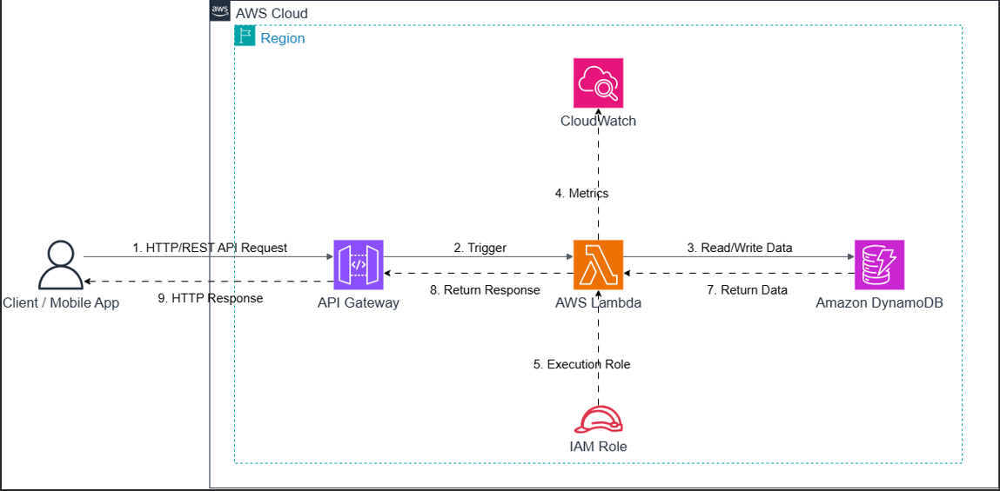

# [CHIA SẺ KINH NGHIỆM] Triển khai ứng dụng Serverless với AWS Lambda và Amazon API Gateway: Khi "không còn server" lại là một lợi thế

### 1. Giới thiệu
Sau khi hoàn thành việc triển khai Backend trên Amazon EC2 và tìm hiểu cách tối ưu chi phí khi vận hành hệ thống trên AWS, nhóm mình bắt đầu đặt ra một câu hỏi:

> Liệu có cách nào triển khai API mà không cần phải tự quản lý máy chủ, hay server, hay không?

Trong thực tế, việc sử dụng Amazon EC2 mang lại rất nhiều quyền kiểm soát:

* Chủ động cấu hình hệ điều hành
* Tự cài đặt runtime
* Quản lý networking
* Quản lý storage
* Cấu hình Security Group

Tuy nhiên, đi kèm với đó là khá nhiều công việc vận hành:

* Theo dõi trạng thái EC2
* Khởi động hoặc tắt instance
* Vá lỗi hệ điều hành
* Cập nhật phần mềm
* Quản lý khả năng mở rộng, hay scaling

Trong quá trình tìm hiểu thêm về các mô hình triển khai ứng dụng trên AWS, nhóm mình được tiếp cận với một kiến trúc hoàn toàn khác: Serverless Computing.

Điểm thú vị là nhà phát triển chỉ cần tập trung viết code, còn việc quản lý hạ tầng sẽ do AWS đảm nhiệm.

Thông qua bài viết này, nhóm mình muốn chia sẻ những kiến thức đã tìm hiểu về việc xây dựng API Serverless bằng AWS Lambda kết hợp với Amazon API Gateway, đồng thời so sánh với mô hình EC2 truyền thống để thấy rõ ưu và nhược điểm của từng cách triển khai.

### 2. Serverless là gì?
Khi mới nghe đến khái niệm Serverless, nhóm mình từng nghĩ rằng:

> Không có server.

Thực tế hoàn toàn không phải như vậy.

Server vẫn tồn tại, nhưng người sử dụng không cần trực tiếp quản lý chúng. Toàn bộ việc phía sau đều được AWS thực hiện, bao gồm:

* Cấp phát tài nguyên
* Khởi động môi trường chạy
* Tự động mở rộng
* Cập nhật hệ điều hành
* Quản lý khả năng chịu tải

Điều này giúp lập trình viên tập trung hoàn toàn vào việc phát triển nghiệp vụ thay vì quản trị hạ tầng.

Đây cũng là lý do vì sao Serverless đang được sử dụng rất nhiều trong:

* REST API
* Backend cho Mobile App
* Chatbot
* IoT
* Event Processing
* AI Pipeline

### 3. Kiến trúc triển khai
Trong mô hình Serverless cơ bản, nhóm mình tìm hiểu kiến trúc như sau.

Developer xây dựng mã nguồn và triển khai function lên AWS Lambda. Người dùng gửi HTTP request tới Amazon API Gateway. API Gateway đóng vai trò là điểm tiếp nhận, hay entry point, sau đó chuyển tiếp request đến Lambda function.

Lambda xử lý toàn bộ nghiệp vụ, có thể truy cập database hoặc các AWS service khác nếu cần, rồi trả kết quả ngược lại thông qua API Gateway.

Khác với EC2, toàn bộ quá trình này diễn ra mà người dùng không cần quản lý bất kỳ máy chủ nào.

### 4. Điều gì khiến Serverless trở nên hấp dẫn?
Sau khi tìm hiểu tài liệu và thực hành các ví dụ cơ bản, nhóm mình nhận thấy có một số ưu điểm rất nổi bật.

#### Không cần quản lý server
Đây là khác biệt lớn nhất.

Ở mô hình EC2, chúng ta phải:

* Khởi tạo instance
* Theo dõi CPU
* Quản lý RAM
* Cập nhật hệ điều hành
* Cấu hình scaling

Trong khi đó với Lambda, AWS chịu trách nhiệm toàn bộ các công việc này.

#### Tự động mở rộng theo lưu lượng
Nếu ứng dụng đột ngột nhận hàng nghìn request cùng lúc, Lambda sẽ tự động tạo thêm môi trường thực thi để đáp ứng.

Khi lượng truy cập giảm, các tài nguyên sẽ tự động được thu hồi. Điều này giúp tránh việc phải dự đoán trước số lượng máy chủ như mô hình truyền thống.

#### Thanh toán theo mức sử dụng
Một trong những điểm khiến nhóm mình ấn tượng nhất là cách AWS tính phí.

Đối với Lambda:

* Không tính tiền khi function không chạy
* Chỉ tính phí theo số lần gọi, hay invocation, và thời gian thực thi

Điều này rất khác với EC2, nơi instance vẫn phát sinh chi phí ngay cả khi không có request nào được xử lý.

Đây cũng là lý do Serverless thường phù hợp với các hệ thống có lưu lượng không ổn định.

### 5. Một số hạn chế cần lưu ý
Mặc dù Serverless mang lại nhiều lợi ích, nhưng qua quá trình tìm hiểu, nhóm mình cũng nhận thấy đây không phải là giải pháp phù hợp cho mọi trường hợp.

#### Cold Start
Khi Lambda không được sử dụng trong một khoảng thời gian, môi trường thực thi có thể bị giải phóng.

Lần gọi đầu tiên sau đó sẽ cần thêm thời gian để khởi tạo function. Hiện tượng này được gọi là cold start.

Đối với các API yêu cầu phản hồi cực nhanh, đây là yếu tố cần được cân nhắc.

#### Giới hạn thời gian thực thi
AWS Lambda được thiết kế cho các tác vụ ngắn.

Nếu ứng dụng cần xử lý liên tục trong thời gian dài hoặc yêu cầu chạy các tiến trình nền phức tạp, EC2 hoặc ECS sẽ phù hợp hơn.

#### Phụ thuộc nhiều vào dịch vụ cloud
Khi sử dụng Lambda, kiến trúc hệ thống sẽ gắn chặt với các dịch vụ của AWS như:

* API Gateway
* IAM
* CloudWatch
* Lambda

Điều này giúp tích hợp rất thuận tiện nhưng cũng làm tăng mức độ phụ thuộc vào nền tảng cloud đang sử dụng.

### 6. Góc nhìn về chi phí
Sau bài viết trước về AWS Cost Management, nhóm mình nhận thấy Serverless cũng mang lại một góc nhìn rất thú vị về tối ưu chi phí.

Ở mô hình EC2:

* Máy chủ hoạt động liên tục
* Chi phí được tính theo thời gian chạy

Trong khi đó với Lambda:

* Không có request thì gần như không phát sinh chi phí tính toán
* Hệ thống tự động mở rộng khi cần
* Không phải duy trì máy chủ luôn hoạt động

Điều này đặc biệt phù hợp với:

* Website có lượng truy cập thấp
* API nội bộ
* Ứng dụng thử nghiệm
* MVP, hay Minimum Viable Product
* Các bài thực hành và nghiên cứu

Tuy nhiên, nếu hệ thống có lưu lượng rất lớn hoặc xử lý liên tục, tổng chi phí Lambda đôi khi có thể cao hơn so với việc vận hành EC2 hoặc ECS. Vì vậy, việc lựa chọn mô hình phù hợp cần dựa trên đặc điểm thực tế của ứng dụng.

### 7. Bài học nhóm mình rút ra
Qua quá trình tìm hiểu kiến trúc Serverless trên AWS, nhóm mình nhận thấy Serverless không phải là giải pháp thay thế hoàn toàn EC2.

Thay vào đó, đây là một lựa chọn khác phù hợp với những bài toán khác nhau.

Nếu cần toàn quyền quản lý hệ điều hành, chạy ứng dụng lâu dài hoặc cấu hình đặc biệt, EC2 vẫn là lựa chọn hợp lý.

Ngược lại, nếu mục tiêu là triển khai nhanh, ít phải quản trị hạ tầng, tự động mở rộng và tối ưu chi phí cho các API có lưu lượng biến động, thì AWS Lambda kết hợp với Amazon API Gateway là một mô hình rất đáng cân nhắc.

Điều quan trọng nhất mà nhóm mình học được không phải là "EC2 tốt hơn Lambda" hay ngược lại, mà là:

> Mỗi dịch vụ trên AWS đều được thiết kế để giải quyết một nhóm bài toán cụ thể. Hiểu rõ đặc điểm của từng dịch vụ sẽ giúp lựa chọn kiến trúc phù hợp ngay từ đầu.

### 8. Kết luận
Thông qua việc tìm hiểu mô hình Serverless, nhóm mình có cơ hội tiếp cận một cách xây dựng ứng dụng hiện đại hơn trên nền tảng AWS.

Việc kết hợp Amazon API Gateway với AWS Lambda giúp giảm đáng kể khối lượng công việc liên quan đến quản trị hạ tầng, đồng thời tận dụng được khả năng tự động mở rộng và cơ chế thanh toán theo mức sử dụng của AWS.

Đối với các dự án học tập, các API có lưu lượng không ổn định hoặc những ứng dụng cần triển khai nhanh, đây là một kiến trúc đáng để trải nghiệm và nghiên cứu.

Trong thời gian tới, nhóm mình cũng mong muốn tìm hiểu sâu hơn về cách kết hợp Lambda với các dịch vụ như Amazon DynamoDB, Amazon S3 và Amazon EventBridge để xây dựng các hệ thống Serverless hoàn chỉnh hơn.

Hy vọng bài chia sẻ này sẽ giúp mọi người có thêm một góc nhìn về mô hình Serverless trên AWS. Nếu các anh/chị và các bạn đã từng triển khai Lambda trong thực tế hoặc có kinh nghiệm tối ưu hiệu năng và chi phí cho kiến trúc Serverless, rất mong được cùng trao đổi và học hỏi thêm trong phần bình luận.

### Hình ảnh kiến trúc

### Link Facebook
[Xem bài viết/trang Facebook](https://web.facebook.com/groups/660548818043427/user/100050719642663/)

#AWS #Lambda #APIGateway #Serverless #CloudComputing #AWSStudyGroupVN #Backend #CloudArchitecture
