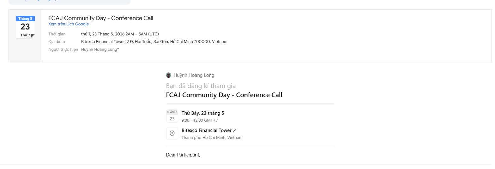

# Bài thu hoạch: FCAJ Community Day - Conference Call

### Thông tin sự kiện

| Mục | Nội dung |
| --- | --- |
| Tên sự kiện | FCAJ Community Day - Conference Call |
| Ngày tham gia | 23/05/2026 |
| Thời gian | 9:00 - 12:00 GMT+7 |
| Địa điểm | Bitexco Financial Tower, Thành phố Hồ Chí Minh, Việt Nam |
| Khu vực theo dõi | Tầng 36 |

Sự kiện có khu vực theo dõi tại tầng 36 dành cho khách mời xem livestream từ sự kiện chính ở tầng 26. Ngoài ra, khách mời tại tầng 36 còn có cơ hội tham gia 10 phiên lucky draw trong suốt thời gian diễn ra sự kiện.

### Lịch trình sự kiện

#### 8:30 - 9:00 AM
Ổn định chỗ ngồi tại tầng 36.

#### 09:00 - 09:30 AM
**Context Is Everything: Making AI Actually Work for You**

* Vì sao AI thất bại khi thiếu ngữ cảnh và "context" thật sự có nghĩa là gì
* Từ prompt đến memory: AI đang phát triển như thế nào với khái niệm Second AI Brain
* Ngữ cảnh tốt hơn giúp tạo kết quả tốt hơn ra sao thông qua tư duy thực tế và mẹo áp dụng
* Chia sẻ định hướng nghề nghiệp và cách sinh viên có thể bắt đầu xây dựng sản phẩm với AI, kèm phần Q&A

#### 09:30 - 10:00 AM
**36 hrs with LotusHacks - Building UTMorpho from Idea to Reality**

* Lý do tham gia LotusHacks
* Từ con số 0 đến ý tưởng - hành trình brainstorming
* Xác định vấn đề và định hình UTMorpho
* Xây dựng dưới áp lực - sprint phát triển trong 36 giờ
* Thử thách, thất bại và các bước ngoặt
* UTMorpho - tổng quan sản phẩm và demo
* Bài học chính và định hướng tiếp theo

#### 10:00 - 10:40 AM
**From Edge To Origin: CloudFront as Your Foundation**

* Amazon CloudFront cho mọi workload
* Tối ưu chi phí với Amazon CloudFront
* Các khả năng bảo mật
* Tăng cường độ tin cậy với Amazon CloudFront
* Tăng cường hiệu năng với Amazon CloudFront

#### 10:40 - 10:55 AM
**Friendly AI Assistant with Amazon Quick**

* Quick Chat Agent: trợ lý AI để khám phá dữ liệu và phân tích insight
* Quick Flows: tạo workflow thông minh bằng ngôn ngữ tự nhiên, không cần lập trình
* Quick Spaces: không gian cộng tác chung giúp chuyển insight cá nhân thành tri thức nhóm
* Quick Sight: xây dựng dashboard và báo cáo từ dữ liệu thô bằng ngôn ngữ tự nhiên

#### 10:55 - 11:00 AM
**Break**

#### 11:00 - 11:30 AM
**Non-Determinism of "Deterministic" LLM Settings**

* Cách LLM chọn token tiếp theo
* Giả định: Temperature=0 đảm bảo tính quyết định
* Thực tế: tối ưu hóa inference có thể tạo ra kết quả khác
* Tác động thực tế
* Chiến lược giảm thiểu

#### 11:30 - 12:00 PM
**Enterprise-Grade Multi-Agent System: The Case of Startup Credit Scoring**

* Sự không tương thích về cấu trúc giữa hệ thống ngân hàng và dữ liệu startup
* Single Agent: khi nào nên và không nên sử dụng
* Mô hình Multi-Agent
* Blueprint của một Virtual Credit Committee
* Guardrails và Compliance
* ROI vận hành và lộ trình triển khai
* Định hướng tiếp theo
* Cảm ơn và Q&A

#### BÀI HỌC RÚT RA
* "Context Is Everything" – Ngữ cảnh quyết định sự thành bại của AI
* Hiểu rõ tính chất bất định của các thiết lập LLM (The Myth of Determinism)
* Từ Single-Agent đến Multi-Agent: Xu hướng tất yếu cho bài toán doanh nghiệp
* Chấp nhận thất bại và linh hoạt chuyển hướng (Pivot) khi chạy nước rút

### Minh chứng tham gia

Hình ảnh dưới đây thể hiện thông tin đăng ký/tham gia sự kiện FCAJ Community Day.

